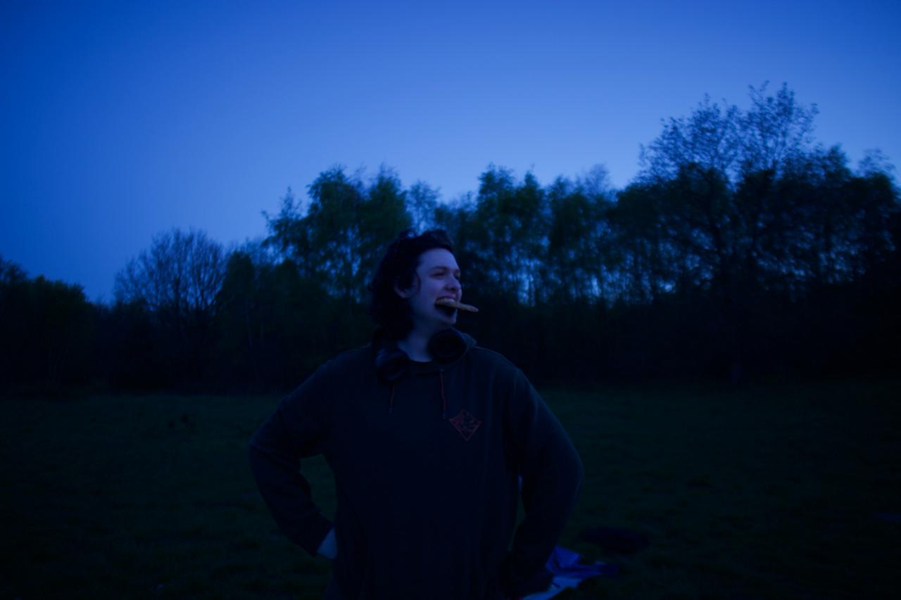

# On the Lyrids

The April Lyrids are a meteor shower lasting roughly 2 weeks, from the 15th to the 29th of April, peaking on the 22nd and
23rd of the month. The meteor shower is located near the constellation Lyra (hence the name), close to the bright star Vega,
which we used as our guiding star to locate the shower.

# New Gear

I had previously been shooting on my phone with a flimsy tripod. I recently bit the bullet and purchased a used Canon 6D
and Samyang 24mm lens, based on extensive research. I decided to get the wider angle lens over the prime 135mm lens knowing
the meteor shower was coming up. DSOs are my bag, but I figured it'd be nicer to try and get a meteor instead.

# Results

Whilst I didn't capture a meteor (I think), I still had such a fun time practicing with my new gear and socialising with
SSI, Sheffield's very own space society. May there be many clear, dark skies ahead!