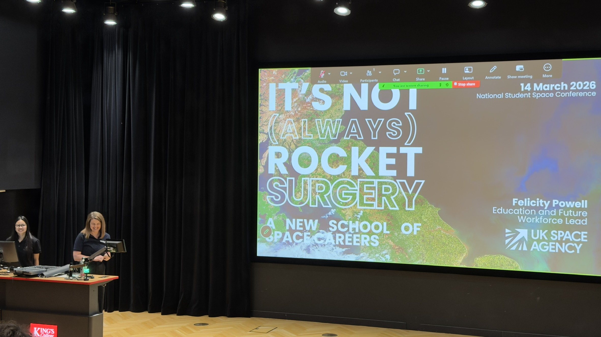
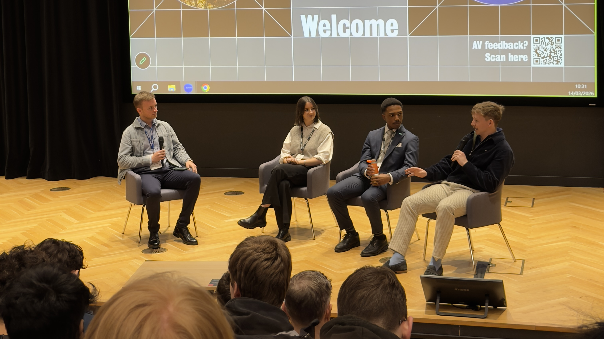
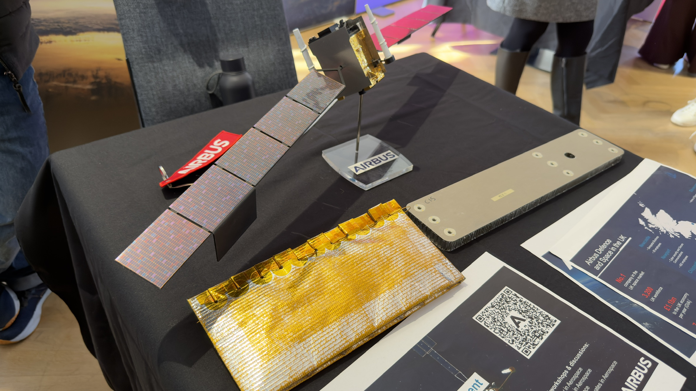
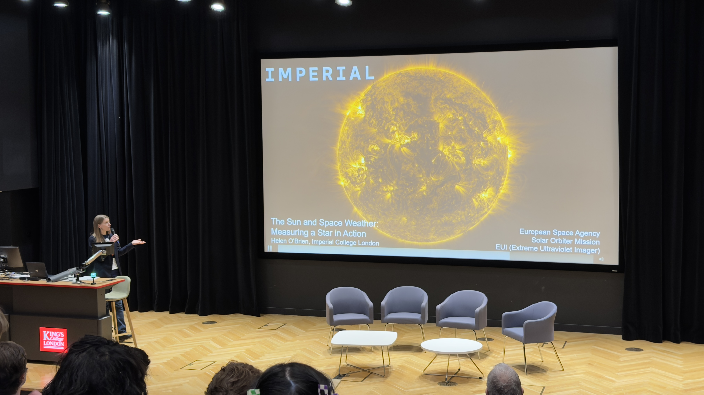

# Reflecting on NSSC Day 1

Wow, what a whirlwind of a day! From networking with industry leaders, getting workshops from some of the key players
in the sector, to meeting hundreds of like-minded students, the first day of the NSSC conference is over!

## Wait, what is NSSC?

NSSC stands for the National Student Space Conference, hosted by UKSEDS, the UK Students for the Exploration and Development of
Space! The yearly conference, on its 38th iteration, was chosen to be hosted in London this year, at King's College
London's prestigious Bush Hall.

## Okay, but why were you there?

Because I want a career in space! I've chosen to devote my time to become an aerospace software engineer, creating the
safety critical software to power space missions for years to come. I've only just begun on my journey into this sector,
which is why I chose to attend the conference this year, as it would give me the foundations to kick-start my career.

## What did you learn?

First of all, the space sector is massive, more so than just the space agencies everybody knows like NASA, ESA and JAXA.
The rise of commercial space flight and infrastructure has lead to a boom in space companies operating out of the UK, 
many of which have strong internship programs. Tools like [rocketpy](https://docs.rocketpy.org/en/latest/) are using
ML in combination with modelling to create more accurate simulations for amateur rocketeers, leading to safer launches.
It uses RAG (**R**etrieval-**A**ugmented **G**eneration) combined with data from NASA
[Giovanni](https://giovanni.gsfc.nasa.gov/giovanni/) and [POWER](https://power.larc.nasa.gov/) to accurately predict
weather based on past patterns. The space weather panel (seen below) was particularly interesting, offering an insight
to an often overlooked part of everyday life, our reliance on satellite technology, and how an ejection from the Sun
could knock us off course.

## What's in stock for day 2?

More panels, exhibitions and networking! The highlight of the day for me is the panel on research, which is a topic that
I have been toying with delving into, so I will definitely be attending!

Thanks very much for reading, hope to see you again soon!