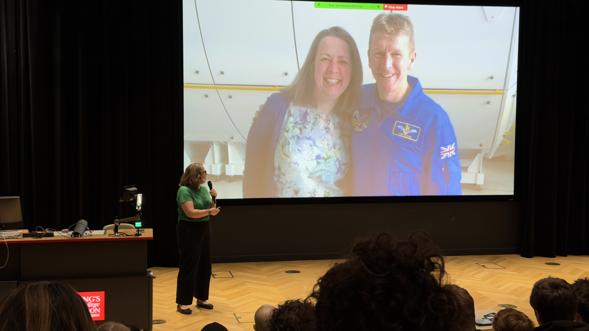
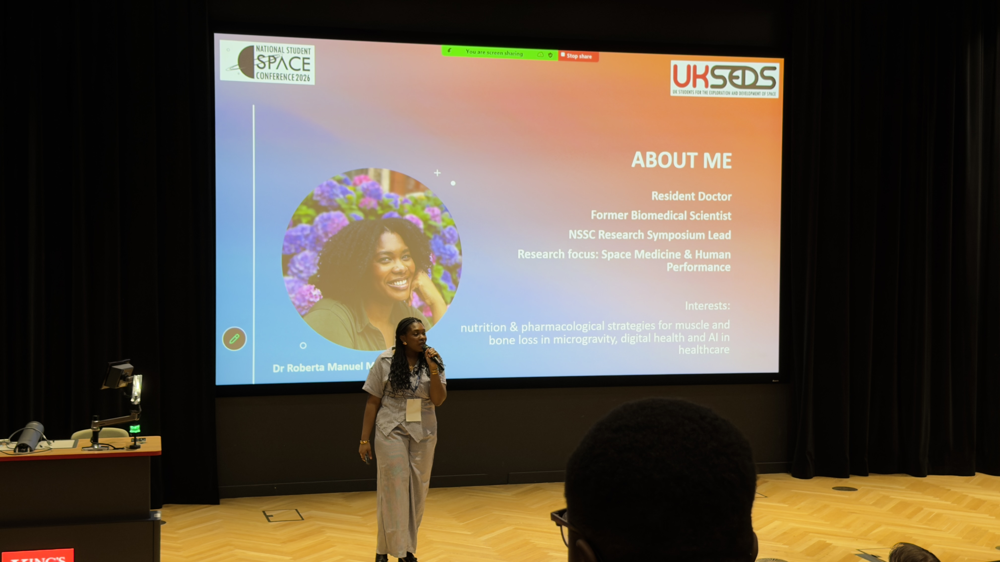
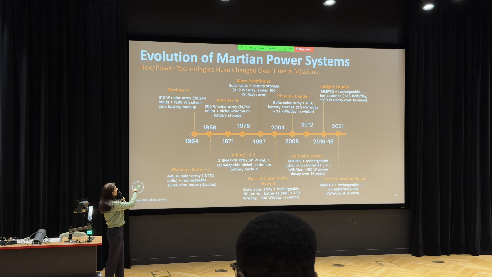
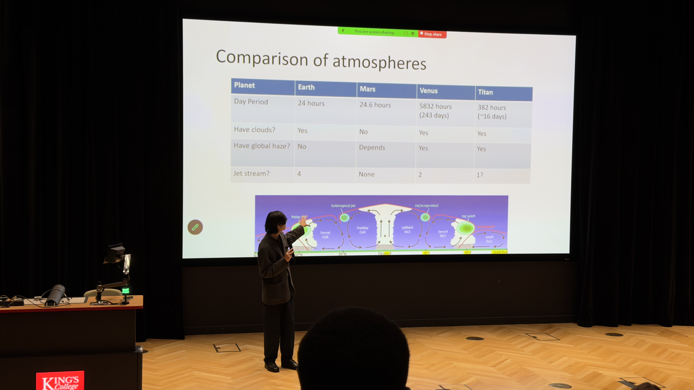
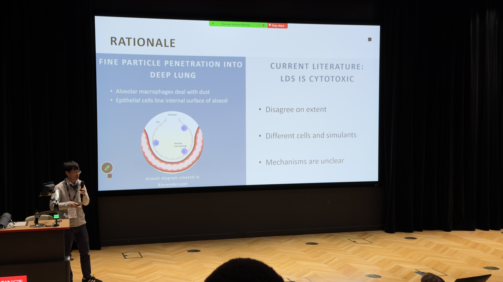
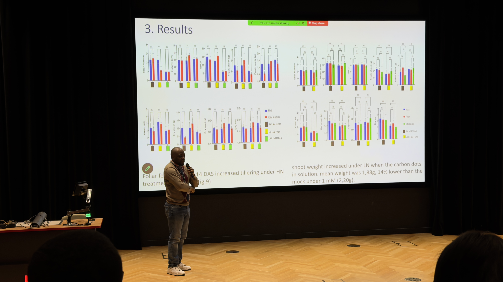
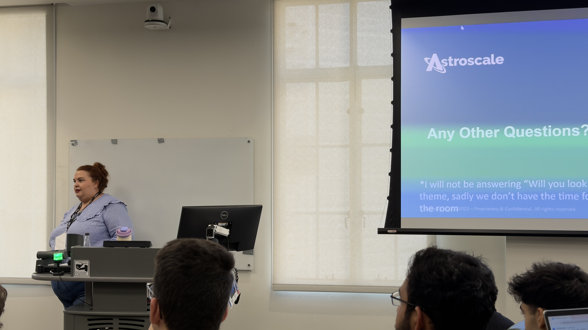
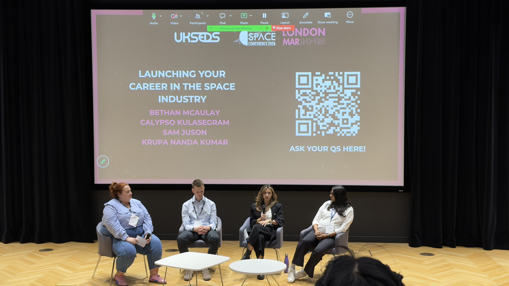
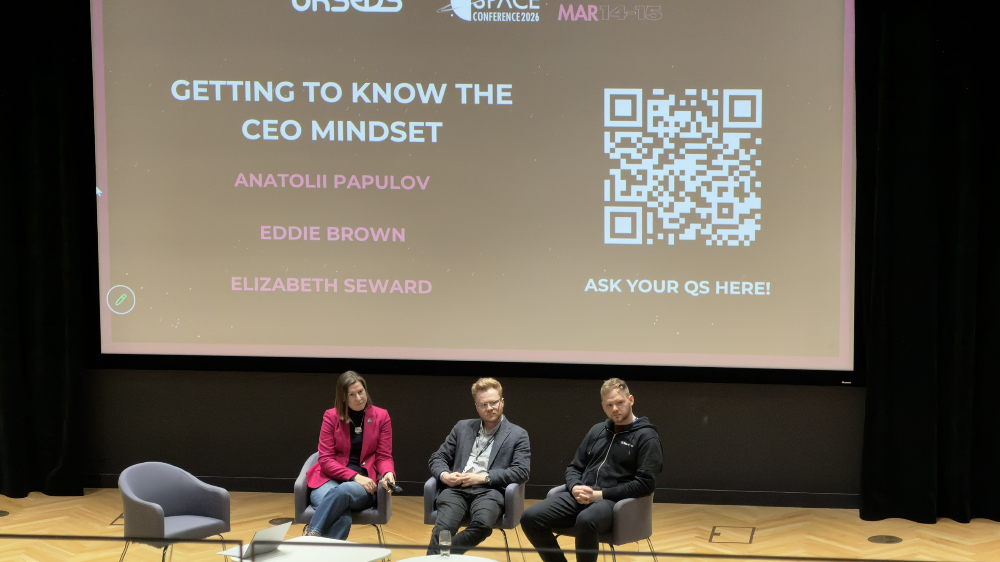

# NSSC Day 2 and the weekend as a whole

A wonderful weekend in the capital draws to a close with what turned out to be a much more career-focused day. From student
research studies from all across the country to CV workshops led by Bethan McAulay of Astroscale, there was plenty to take
away; here's my roundup.

## Opening talk from Libby Jackson @ Science Museum, London

A fantastic talk from someone who's spent a long time working in the space sector, sharing her journey across several
disciplines. She has worked as the Columbus module Flight Director and at the UK Space Agency, and now works as the Head
of Space at the Science Museum.

## Space Research Symposium

### Talk 1 - Using Earth Observation (EO) data to identify amenities - Armaan Khan

This talk really resonated with me on a personal level. Only 1/300 FOI requests to local councils lead to accurate GPS
locations of amenities such as benches. By training a machine learning algorithm to detect sub-metre sized objects,
Armaan was able to achieve >80% accuracy. Earth observation data can actively impact and benefit everyone's lives!

### Talk 2 - Using Radioactive Thermoelectric Generators on Mars - Fatima Sajid

A fascinating talk on the use of RTGs in Mars missions, how effective they are and how the technology might evolve
in the future. I learned about the physics behind RTGs, namely the [Seebeck effect](https://en.wikipedia.org/wiki/Thermoelectric_effect#Seebeck_effect)
$$V=S\Delta T$$ where $V$ is the potential difference, $S$ stands for the Seebeck coefficient (also known as the
thermopower) of the material, and $\Delta T$ is the temperature difference between the two junctions, in $K$. Fatima also
discussed how Americium-241 may be favoured over the current choice of radioactive isotope Plutonium-238 as it is cheaper,
more widely available and has a much longer half-life, meaning it could power Mars missions for years to come.

### Talk 3 - Using Venus to study hazy atmospheres - Ksai Lee

The next talk was by Ksai Lee, and he discussed how we could use Venus to study hazy atmospheres like the one found on
the moon of Titan. Titan has a similar hazy atmosphere to Venus, which is why we can study one to gain a better insight
into the other. Both bodies have clouds, and differences in air pressure and temperature mean that Venus has wind currents,
and even cyclones! This could be a fascinating research route as some exoplanets experience the same atmospheric conditions
and weather as Venus and Titan, so the data we gather from our planetary neighbours could help facilitate even more planetary
science in the near future.

### Talk 4 - Lunar Dust Simulant pulmonary effects - Michael Song

The penultimate talk discussed how different lunar dust simulants may affect our lungs. Lunar dust is electrostatically
charged, meaning that it clings to spacesuits and ships. This poses a potential risk to our astronauts, which is why this
study aimed to set a framework for testing exactly that. Interestingly, it claimed that no cell necrosis was reported,
directly contradicting most other studies, meaning that the risks around lunar dust may need to be re-evaluated.

### Talk 5 - Hydroponics for stress reduction in space - John Masengo

The final talk briefly touched on how we could be using hydroponic farms to reduce the stress of living in space.
Humans experience over 70% of their surroundings visually, and having bushy green plants helps to reduce stress. It was
found that barley was the best choice of plant, and higher nitrogen environments led to better growth as they better
mimic the environment found on Earth.

## CV Workshop

One of the most interesting things today was the workshop about how to write CVs and the format and structure when applying
to graduate roles. One of my key takeaways was: No-one expects you to have years of experience after graduating from university.
At that point in your career, it's about showing what you know from personal projects and extracurriculars like uni
societies and sports. It felt great to finally be able to share my updated CV on my [homepage](https://liampallett.github.io).

## Launching your career in space

The penultimate session I attended was regarding kick-starting your career. From summer internships to graduate roles, this
Q&A panel had everything an aspiring engineer could want, and I'm so glad I attended. One opportunity that kept coming 
up was Cranfield University, and their offering of an Astronautics and Space Engineering degree, which is something that
I am definitely now considering after my current studies. There is a lot of support for young engineers in the industry,
which is reassuring for my future in the sector. The UK Government is heavily funding startup companies via the UK Space
Agency, meaning that graduate hiring is at an all-time high. Yet again networking was brought up as a key skill to develop,
which I very much did this weekend. I'm so happy to have made so many new connections this weekend, and look forward to
keeping in touch with everyone into the coming years.

## From London, Brimming With Inspiration

From actionable steps, to new friends, NSSC '26 was one of the best events of my life. A massive thank you to everyone
who organised the event and everyone that volunteered, you truly made a weekend to remember.

Thank you for reading, write again soon.

*P.S. read day 1's summary [here](https://liampallett.github.io/blog/nssc-day-1).*